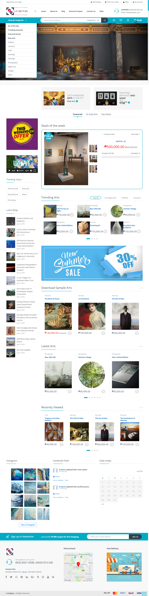

# Artbytes

Project under Engr. April

## Getting Started

These instructions will get you a copy of the project up and running on your local machine for development and testing purposes. See deployment for notes on how to deploy the project on a live system.

## Installation
```
> The database is located in db/artbytess.sql
```

```
> Open localhost/phpmyadmin and import the sql file
```

```
> Go to localhost/artbytess/wp-admin.php then login using 
Username: admin
Password: admin
```

### Landing Page


## License

This project is licensed under the MIT License - see the [LICENSE](https://en.wikipedia.org/wiki/MIT_License) file for details

- [stnbnvdz](https://github.com/stnbnvdz)

